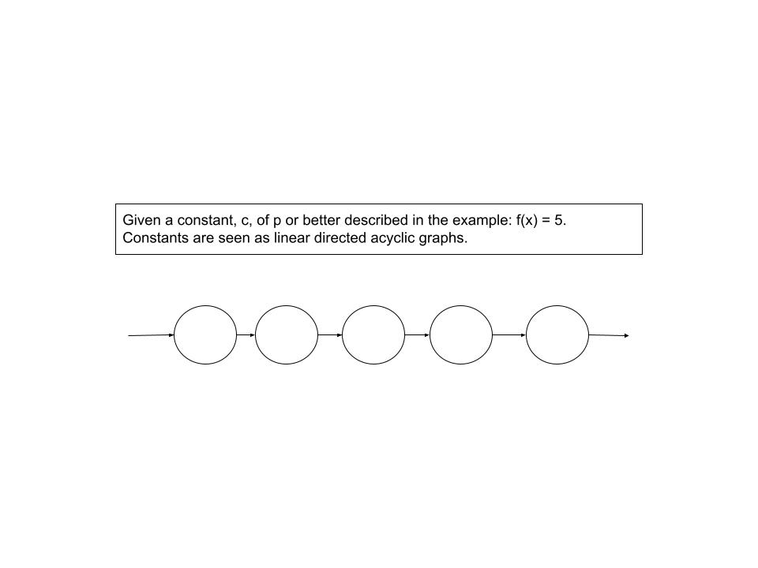

# A Language of Polynomials

Each slide can be formalized even further as their own research paper but presenting in this manner allows my ideas to give intuitive bearing so that it gives people from various backgrounds to come up with their own theories, ideas, and applications. On the other hand, this is also a formalized proof in my style of construction.

-----

## References For The Tools Used 
[Theory of Computation](https://en.wikipedia.org/wiki/Introduction_to_the_Theory_of_Computation)\
[Topology](https://math.ucr.edu/~res/math205B-2018/Munkres%20-%20Topology.pdf)\
[Algebra](https://math.mit.edu/~hrm/palestine/artin-algebra.pdf)\
[Logic](https://dn790009.ca.archive.org/0/items/MathematicalIntroductionToLogicEnderton/MathematicalIntroductionToLogic-Enderton.pdf)\
[Analysis](https://zlib.pub/book/analysis-with-an-introduction-to-proof-1q70kqfatdhg)
