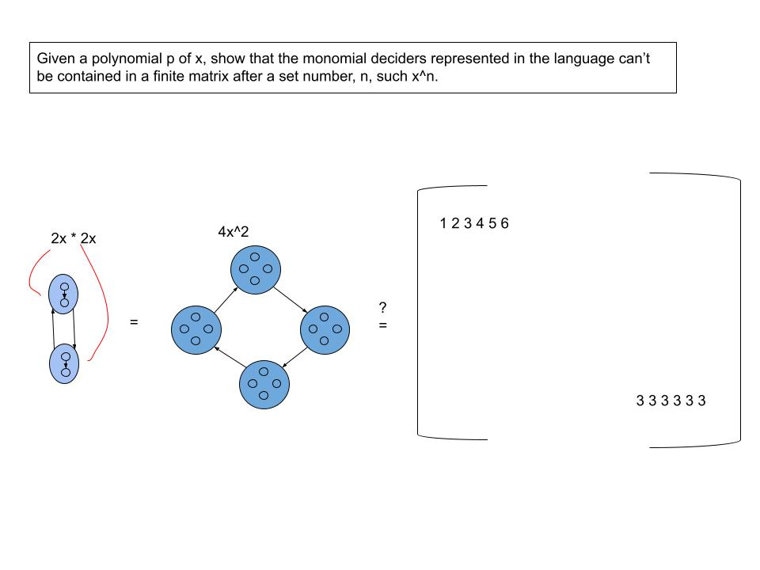

# A Language of Polynomials

Each slide can be formalized even further as their own research paper but presenting in this manner allows my ideas to give intuitive bearing so that it gives people from various backgrounds to come up with their own theories, ideas, and applications. On the other hand, this is also a formalized proof in my style of construction.

### 1. Foundations

### 2. Monomial of One Degree

### 3. Commutativity

### 4. Product

### 5. Problem with Matrices

### 6. Multivariable Polynomials

### 7. Generalized Monomial Deciders

### 8. Concentric Monomial Deciders

### 9. Constants

### 10. Division

### 11. Multiple Divisions

### 12. Equivalence

### 13. Reversing

### 14. Corollary of Reversing

### 15. Godel's Theorem

### 16. Constructing The One Way Function

### 17. Infiniteness

-----

### References
Sipser, M. (2006). [Theory of Computation](https://en.wikipedia.org/wiki/Introduction_to_the_Theory_of_Computation) (2nd ed., p. 431). Course Technology, Cengage Learning.\
Munkres, J. R. (2000). [Topology](https://math.ucr.edu/~res/math205B-2018/Munkres%20-%20Topology.pdf) (2nd ed., p. 537). Prentice Hall.\
Artin, M. (2011). [Algebra](https://math.mit.edu/~hrm/palestine/artin-algebra.pdf) (2nd ed., p. 543). Pearson.\
Enderton, H. B. (2001). [Logic](https://dn790009.ca.archive.org/0/items/MathematicalIntroductionToLogicEnderton/MathematicalIntroductionToLogic-Enderton.pdf) (2nd ed., p. 317). HARCOURT/ACADEMIC PRESS.\
Lay, S. R. (2004). [Analysis](https://zlib.pub/book/analysis-with-an-introduction-to-proof-1q70kqfatdhg) (4th ed., p. 394). Pearson Prentice Hall.\
Cox, D. A., Little, J., & O’Shea, D. (1997). *Ideals, varieties, and algorithms: An introduction to computational algebraic geometry and commutative algebra* (2nd ed.). Springer.\
Golub, G. H., & Van Loan, C. F. (1996). *Matrix Computations* (3rd ed., p. 728). Johns Hopkins University Press.\
Hofstadter, D. R. (1999). *Gödel, Escher, Bach: An eternal golden braid.* Basic Books.\
Cormen, T. H., Leiserson, C. E., Rivest, R. L., & Stein, C. (2009). *Introduction to Algorithms* (3rd ed.). MIT Press.\
Shilov, G. E. (2012). *Linear algebra* (R. A. Silverman, Trans.). Dover Publications. (Original work published 1971)\
Strang, G. (2009). *Introduction to Linear Algebra* (4th ed., p. 585). Wellesley-Cambridge Press.\
Rosen, K. H. (2006). *Discrete Mathematics And Its Applications* (6th ed.). McGraw-Hill Education.\
Prasolov, V. V. (1995). *Intuitive topology*. American Mathematical Society.\
Carter, N. (2009). *Visual group theory*. Mathematical Association of America.\
Spivak, M. (2008). *Calculus* (4th ed., p. 680). Publish or Perish.\
Sullivan, M. (2008). *Precalculus* (8th ed., p. 1152). Prentice Hall.
